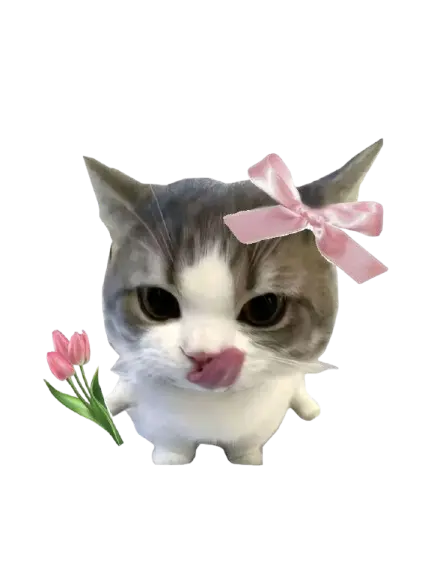

<h1 align="center">Hi 👋, I'm Garv</h1>
<h3 align="center">
  Software Engineer at Microsoft
  
</h3>

<picture>
  <source
    media="(prefers-color-scheme: dark)"
    srcset="https://pvt-repo-github-readme-git-main-cruelkratos-projects.vercel.app/api?username=cruelkratos&show_icons=true&theme=github_dark&count_private=true&include_all_commits=true"/>
  <source
    media="(prefers-color-scheme: light)"
    srcset="https://pvt-repo-github-readme-git-main-cruelkratos-projects.vercel.app/api?username=cruelkratos&show_icons=true&theme=default&count_private=true&include_all_commits=true"/>
  
</picture>

 
 

<picture>
  <!-- <source media="(prefers-color-scheme: dark)" srcset="assets/download.webp">
  <source media="(prefers-color-scheme: light)" srcset="assets/download.webp"> -->
  
</picture>

<picture>
  <!-- <source media="(prefers-color-scheme: dark)" srcset="assets/download__1_-removebg-preview.webp">
  <source media="(prefers-color-scheme: light)" srcset="assets/download__1_-removebg-preview.webp"> -->
  
</picture>

<picture>
  <!-- <source media="(prefers-color-scheme: dark)" srcset="https://github.com/user-attachments/assets/7b2f4d0b-9b80-46ee-9ea5-86fd253436ee">
  <source media="(prefers-color-scheme: light)" srcset="https://github.com/user-attachments/assets/7b2f4d0b-9b80-46ee-9ea5-86fd253436ee"> -->
  
</picture>

<picture>
  <!-- <source media="(prefers-color-scheme: dark)" srcset="https://github.com/user-attachments/assets/bec8ca16-c140-4d52-90d6-6824f66a2805">
  <source media="(prefers-color-scheme: light)" srcset="https://github.com/user-attachments/assets/bec8ca16-c140-4d52-90d6-6824f66a2805"> -->
  
</picture>

